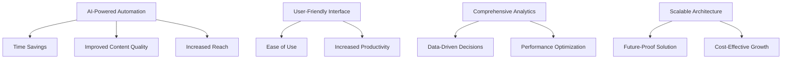
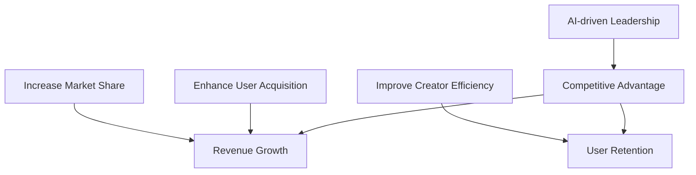
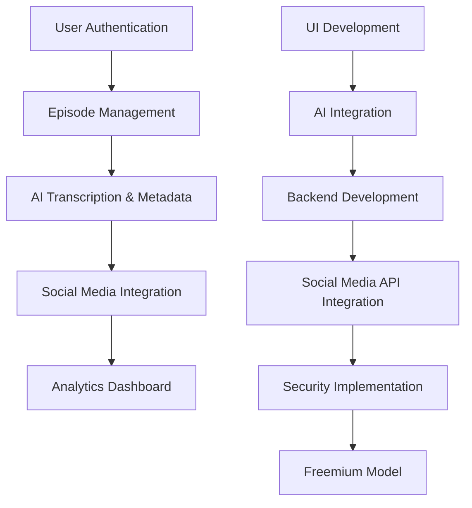
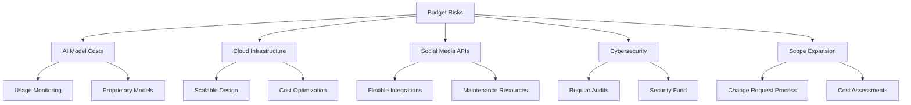
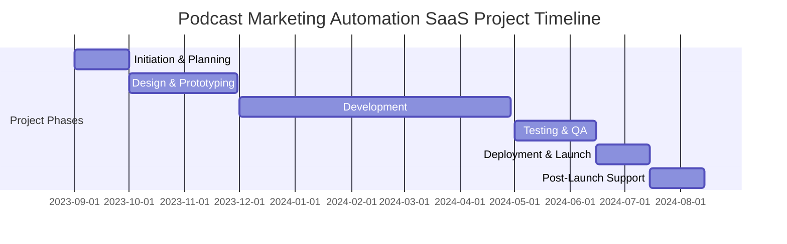
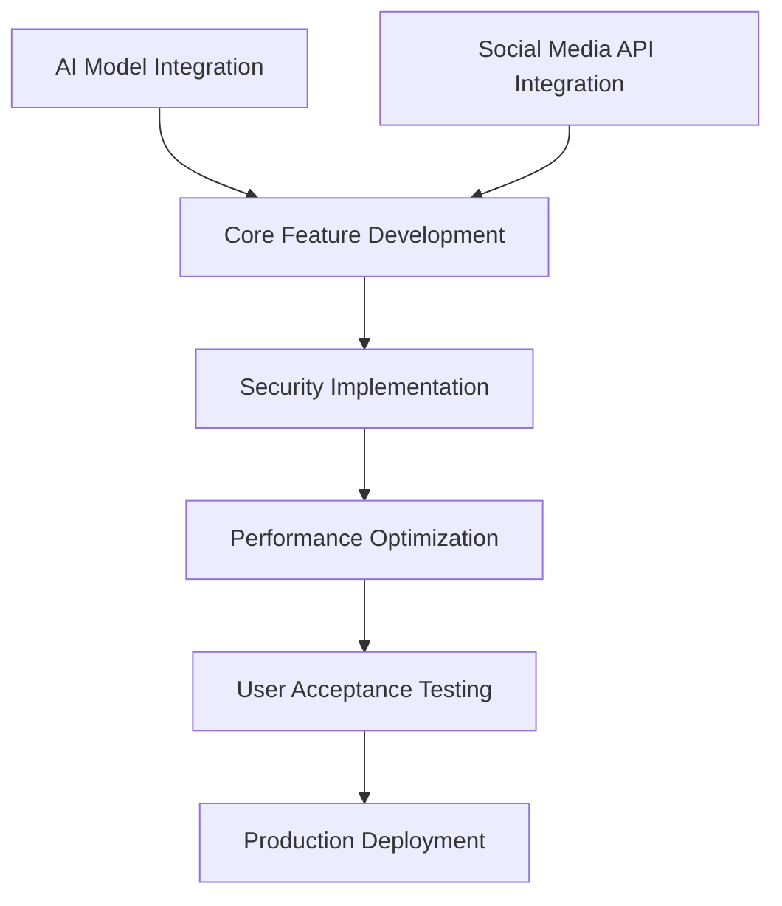
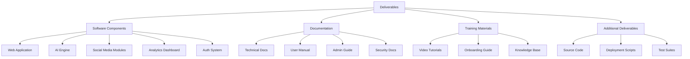

# EXECUTIVE SUMMARY

## PROJECT OVERVIEW

This project aims to develop a cutting-edge Podcast Marketing Automation SaaS platform that revolutionizes the way podcast creators manage, distribute, and market their content. The solution addresses the time-consuming and complex process of podcast production and promotion by leveraging AI technology to automate key tasks, allowing creators to focus on what they do best: creating compelling content.

The platform solves several critical pain points for podcast creators:

1. Streamlines episode management and metadata generation
2. Automates transcription and content analysis
3. Creates and schedules AI-generated marketing content across social media platforms
4. Provides comprehensive analytics for performance tracking

By automating these processes, the platform significantly reduces the time and effort required for podcast production and marketing, enabling creators to increase their output and reach a wider audience.

## OBJECTIVES

The key objectives of this project are:

1. Develop a user-friendly, AI-powered podcast management system
2. Implement automated transcription and metadata generation capabilities
3. Create an AI-driven marketing content generator for social media platforms
4. Design an intuitive analytics dashboard for tracking podcast and marketing performance
5. Integrate secure user authentication and data encryption features
6. Deliver a scalable and maintainable solution using modern technology stack

These objectives aim to provide the following benefits to podcast creators:

- Reduced time spent on administrative tasks
- Improved consistency and quality of metadata and marketing content
- Increased social media presence and audience engagement
- Better insights into podcast performance and audience behavior
- Enhanced security and privacy for sensitive content

## VALUE PROPOSITION

Our agency offers unique value for this project through:

1. **AI Expertise**: Our team has extensive experience in developing and integrating AI solutions, ensuring cutting-edge capabilities in transcription, content analysis, and marketing content generation.

2. **Full-Stack Development**: With proficiency in both frontend (React, TypeScript) and backend (Django) technologies, we can deliver a cohesive and performant solution.

3. **User-Centric Design**: Our focus on clean, intuitive interfaces and responsive design ensures a superior user experience across devices.

4. **Scalability and Security**: We prioritize building scalable architectures and implementing robust security measures to protect user data and content.

5. **Social Media Integration**: Our expertise in working with various social media APIs enables seamless integration for automated content distribution.

6. **Agile Methodology**: We employ an agile development approach, allowing for flexibility, regular client feedback, and iterative improvements throughout the project lifecycle.

This value proposition positions our agency as the ideal partner to deliver a transformative podcast marketing automation platform that will empower creators and revolutionize the podcasting industry.

# PROJECT OBJECTIVES

## BUSINESS GOALS

The Podcast Marketing Automation SaaS project aims to achieve the following high-level business outcomes:

1. Increase market share in the podcast management and marketing space
2. Boost revenue through subscription-based pricing model
3. Enhance user acquisition and retention rates
4. Improve podcast creators' efficiency and productivity
5. Establish the platform as a leader in AI-driven podcast marketing solutions

## TECHNICAL GOALS

The project's technical objectives include:

1. Develop a scalable and robust cloud-based architecture to handle increasing user load
2. Implement AI-powered transcription with high accuracy (>95%)
3. Create an AI engine for generating metadata and marketing content
4. Integrate with major social media platforms' APIs for automated content distribution
5. Design and implement a responsive, user-friendly interface using React and TypeScript
6. Develop a secure backend using Django, ensuring data privacy and protection
7. Implement real-time analytics processing for immediate insights
8. Achieve optimal performance with page load times under 2 seconds

## SUCCESS CRITERIA

The success of the project will be measured using the following metrics and indicators:

| Criterion | Target | Measurement Method |
|-----------|--------|---------------------|
| User Adoption | 10,000 active users within 6 months of launch | User registration and activity tracking |
| Transcription Accuracy | >95% accuracy rate | Automated and manual quality checks |
| Time Saved for Users | Average of 5 hours per week per user | User surveys and time tracking analysis |
| Marketing Content Engagement | 25% increase in social media engagement for users | Social media analytics integration |
| Platform Uptime | 99.9% availability | Server monitoring tools |
| Customer Satisfaction | Net Promoter Score (NPS) of 8+ | Regular user surveys |
| Revenue Growth | 20% month-over-month growth in first year | Financial reporting |
| Feature Utilization | 80% of paid users utilizing AI marketing features | Feature usage analytics |
| Load Time Performance | <2 seconds average page load time | Performance monitoring tools |
| Churn Rate | <5% monthly churn for paid subscribers | User subscription data analysis |

These success criteria will be regularly monitored and evaluated to ensure the project meets its objectives and delivers value to both the business and its users.

# SCOPE OF WORK

## IN-SCOPE

The following tasks, features, and functionalities are included in the Podcast Marketing Automation SaaS project:

1. User Authentication and Management
   - User registration and login system
   - Role-based access control (Creator/Host and Collaborator roles)
   - User profile management

2. Podcast Episode Management
   - Audio file upload functionality (supporting MP3 and WAV formats)
   - Cloud-based storage integration for audio files
   - Episode status management (draft, scheduled, published)

3. AI-Powered Transcription and Metadata Creation
   - Automated transcription of podcast episodes
   - AI-driven title, description, and tag generation
   - Transcript editing interface for users

4. Social Media Marketing Integration
   - AI-generated marketing content for LinkedIn, Facebook, X, and Instagram
   - Post scheduling functionality across platforms
   - Dynamic content generation (links, quotes, hashtags)

5. Analytics Dashboard
   - Episode performance metrics (downloads, engagement trends)
   - Social media metrics (reach, engagement, click-throughs)
   - Customizable reporting periods

6. User Interface Development
   - Responsive design for desktop and mobile devices
   - Light and dark mode support
   - Left-side navigation bar with main sections

7. AI Integration
   - Implementation of AI models for transcription and content generation
   - Integration with GPT or similar models for natural language processing

8. Backend Development
   - Django-based REST API development
   - Database design and implementation
   - API endpoints for all core functionalities

9. Social Media API Integration
   - Development of connectors for Facebook, LinkedIn, X, and Instagram APIs
   - OAuth implementation for secure account linking

10. Security Implementation
    - User authentication and authorization
    - Data encryption at rest and in transit
    - Secure handling of API keys and sensitive information

11. Freemium Model Implementation
    - Free tier with limited features
    - Paid plan(s) with advanced features and increased storage

## OUT-OF-SCOPE

The following items are explicitly excluded from the project scope:

1. Podcast hosting or content delivery network (CDN) services
2. Audio editing or production tools
3. Direct monetization features (e.g., paid subscriptions for podcast listeners)
4. Custom mobile applications (iOS/Android)
5. Integration with podcast directories (e.g., Apple Podcasts, Spotify)
6. Live streaming capabilities
7. Multi-language support (beyond English)
8. Advanced audio analysis (e.g., speaker diarization, sentiment analysis)
9. Customer support system or helpdesk integration
10. Third-party plugin or extension ecosystem

## ASSUMPTIONS

The project plan is based on the following assumptions:

1. The client will provide timely feedback and approvals at designated project milestones.
2. Necessary API access and documentation for social media platforms will remain stable and accessible.
3. The selected AI models (e.g., GPT) will continue to be available and suitable for the project's needs.
4. Cloud infrastructure costs will remain within the projected budget.
5. The client has secured necessary rights and permissions for integrating with third-party services.
6. The development team has access to required development tools and environments.
7. The project timeline accounts for potential iterations based on user testing feedback.
8. The client will provide sample podcast content for testing and demonstration purposes.
9. The selected technology stack (React, Django, etc.) will remain suitable throughout the development lifecycle.
10. The client has a clear understanding of data privacy regulations and requirements in target markets.

## DEPENDENCIES

The project has the following dependencies that could impact the timeline or deliverables:

| Dependency | Description | Potential Impact |
|------------|-------------|-------------------|
| AI Model Availability | Access to and performance of selected AI models for transcription and content generation | Could affect accuracy and speed of core AI features |
| Social Media APIs | Stability and continued access to APIs for LinkedIn, Facebook, X, and Instagram | May impact social media integration and marketing automation features |
| Cloud Services | Reliability and scalability of chosen cloud infrastructure provider | Could affect system performance, storage capacity, and operational costs |
| Third-party Libraries | Availability and compatibility of key open-source libraries and frameworks | May influence development speed and feature implementation |
| SSL Certificates | Timely acquisition and renewal of SSL certificates for secure connections | Could delay launch or cause security vulnerabilities if not addressed |
| Payment Gateway | Integration and reliability of chosen payment processing system for premium subscriptions | May affect monetization strategy and user upgrade process |
| Data Privacy Compliance | Adherence to evolving data protection regulations (e.g., GDPR, CCPA) | Could require additional development time for compliance features |
| User Testing Feedback | Timely completion of user acceptance testing and incorporation of feedback | May lead to additional development cycles and feature refinement |
| Content Delivery Network | Performance and global reach of selected CDN for audio file delivery | Could impact user experience and podcast playback quality |
| Development Team Availability | Consistent availability of key team members throughout the project | May affect project timeline and knowledge transfer |

These dependencies will be closely monitored throughout the project lifecycle to mitigate risks and ensure timely delivery of the Podcast Marketing Automation SaaS platform.

# BUDGET AND COST ESTIMATES

## COST BREAKDOWN

The following table provides a detailed breakdown of the project costs for the Podcast Marketing Automation SaaS platform:

| Category | Item | Cost (USD) |
|----------|------|------------|
| Labor | Frontend Development (React, TypeScript) | $60,000 |
| Labor | Backend Development (Django) | $55,000 |
| Labor | AI Integration and Development | $70,000 |
| Labor | UI/UX Design | $30,000 |
| Labor | Project Management | $40,000 |
| Labor | Quality Assurance and Testing | $35,000 |
| Software | Development Tools and Licenses | $5,000 |
| Infrastructure | Cloud Services (Initial Setup and 1 Year) | $30,000 |
| Infrastructure | AI Model API Costs (1 Year) | $50,000 |
| Services | Social Media API Integration | $10,000 |
| Services | Security Audit and Penetration Testing | $15,000 |
| Contingency | Risk Management Fund (10% of total) | $40,000 |
| **Total** | | **$440,000** |

## PAYMENT SCHEDULE

The proposed payment schedule is tied to project milestones and deliverables:

| Milestone | Deliverable | Payment (% of Total) | Amount (USD) |
|-----------|-------------|----------------------|--------------|
| Project Kickoff | Signed Contract and Project Plan | 20% | $88,000 |
| Design Approval | Approved UI/UX Designs | 15% | $66,000 |
| Alpha Release | Core Functionality Implementation | 25% | $110,000 |
| Beta Release | Feature-Complete with Initial Testing | 20% | $88,000 |
| Final Delivery | Fully Tested and Deployed Solution | 15% | $66,000 |
| Post-Launch Support | 30 Days of Post-Launch Support | 5% | $22,000 |

## BUDGET CONSIDERATIONS

Several factors could impact the budget and require careful management:

1. AI Model Costs: The costs associated with AI models for transcription and content generation may fluctuate based on usage and pricing changes from providers.

   - Mitigation: Implement usage monitoring and consider developing proprietary models for high-volume tasks.

2. Cloud Infrastructure Scaling: As user adoption grows, cloud infrastructure costs may increase more rapidly than anticipated.

   - Mitigation: Design for scalability and implement cost optimization strategies early in development.

3. Social Media API Changes: Updates or policy changes to social media platform APIs may require additional development work.

   - Mitigation: Build flexible integrations and allocate resources for ongoing maintenance.

4. Cybersecurity Enhancements: Evolving security threats may necessitate additional investments in security measures.

   - Mitigation: Regular security audits and allocation of funds for ongoing security improvements.

5. Feature Scope Expansion: Client requests for additional features may impact the project timeline and budget.

   - Mitigation: Implement a clear change request process with associated cost assessments.

To manage these budget considerations effectively, we will:

1. Conduct monthly budget reviews to track expenses against projections.
2. Maintain open communication with the client about potential budget impacts.
3. Prioritize features to ensure core functionality is delivered within budget.
4. Explore cost-saving opportunities through efficient development practices and resource allocation.
5. Utilize the contingency fund judiciously to address unforeseen challenges without compromising project quality.

By carefully monitoring these factors and implementing proactive management strategies, we aim to deliver the Podcast Marketing Automation SaaS platform within the proposed budget while maintaining flexibility to address changing needs and market conditions.

# TIMELINE AND MILESTONES

## PROJECT TIMELINE

The Podcast Marketing Automation SaaS project will be developed over a 9-month period, divided into the following major phases:

## KEY MILESTONES

The following table outlines the critical milestones that mark significant progress points in the project:

| Milestone | Description | Target Date |
|-----------|-------------|-------------|
| Project Kickoff | Completion of project initiation and planning phase | 2023-09-30 |
| Design Approval | Finalization and approval of UI/UX designs and prototypes | 2023-11-30 |
| Alpha Release | Completion of core functionality development | 2024-02-29 |
| Beta Release | Feature-complete version ready for comprehensive testing | 2024-04-30 |
| User Acceptance Testing | Completion of UAT and incorporation of feedback | 2024-06-14 |
| Production Deployment | Official launch of the platform | 2024-07-15 |
| Post-Launch Review | Evaluation of platform performance and user feedback | 2024-08-15 |

## CRITICAL PATH

The following tasks and activities are critical to keeping the project on schedule:

1. **AI Model Integration (2023-12-01 to 2024-01-31)**
   - Implementation of transcription and content generation AI models
   - Integration with backend services

2. **Social Media API Integration (2024-01-01 to 2024-02-29)**
   - Development of connectors for Facebook, LinkedIn, X, and Instagram APIs
   - Implementation of OAuth for secure account linking

3. **Core Feature Development (2023-12-01 to 2024-04-30)**
   - Podcast episode management system
   - AI-powered transcription and metadata creation
   - Social media marketing automation
   - Analytics dashboard

4. **Security Implementation (2024-03-01 to 2024-04-30)**
   - User authentication and authorization
   - Data encryption and secure API handling

5. **Performance Optimization (2024-05-01 to 2024-06-14)**
   - Ensuring system scalability and responsiveness
   - Optimizing AI processing times

6. **User Acceptance Testing (2024-06-01 to 2024-06-14)**
   - Comprehensive testing with select users
   - Rapid iteration based on feedback

To ensure the project remains on track:

- Weekly progress reviews will be conducted to monitor the status of critical path items.
- Any delays in critical path tasks will be immediately escalated and addressed.
- Resources will be dynamically allocated to prioritize critical path activities when necessary.
- Regular communication with stakeholders will be maintained to manage expectations and address any potential roadblocks.

By closely monitoring these critical path elements and maintaining flexibility in our approach, we aim to deliver the Podcast Marketing Automation SaaS platform on time and to the highest quality standards.

# DELIVERABLES

## LIST OF DELIVERABLES

The Podcast Marketing Automation SaaS project will produce the following tangible outputs:

1. Software Components:
   - Fully functional web application (frontend and backend)
   - AI-powered transcription and content generation engine
   - Social media integration modules
   - Analytics dashboard
   - User authentication and authorization system

2. Documentation:
   - Technical documentation (API documentation, system architecture)
   - User manual and help guides
   - Administrator guide
   - Security and compliance documentation

3. Training Materials:
   - Video tutorials for key features
   - Interactive onboarding guide for new users
   - Knowledge base articles

4. Additional Deliverables:
   - Source code repository
   - Deployment scripts and configuration files
   - Test suites and quality assurance reports

## DELIVERY SCHEDULE

The following table outlines the expected delivery dates for each major deliverable:

| Deliverable | Expected Delivery Date |
|-------------|------------------------|
| System Architecture Document | 2023-10-15 |
| UI/UX Design Mockups | 2023-11-30 |
| Alpha Release (Core Functionality) | 2024-02-29 |
| Beta Release (Feature Complete) | 2024-04-30 |
| User Manual (Draft) | 2024-05-15 |
| API Documentation | 2024-05-31 |
| Video Tutorials | 2024-06-15 |
| Security and Compliance Documentation | 2024-06-30 |
| Final Web Application | 2024-07-15 |
| Complete Documentation Package | 2024-07-31 |
| Training Materials | 2024-08-15 |

## ACCEPTANCE CRITERIA

The following criteria will be used to determine the acceptance of key deliverables:

1. Web Application:
   - Meets all functional requirements specified in the PRD
   - Passes all automated tests with >95% coverage
   - Achieves <2 second average page load time
   - Successfully integrates with all specified social media platforms
   - Demonstrates AI transcription accuracy of >95%
   - Supports concurrent users as per performance requirements

2. Documentation:
   - Comprehensive coverage of all features and functionalities
   - Clear, concise, and free of technical errors
   - Includes all necessary diagrams and illustrations
   - Passes review by technical and non-technical stakeholders

3. Training Materials:
   - Cover all key features of the platform
   - Provide step-by-step guidance for common user tasks
   - Available in both video and text formats
   - Receive positive feedback from a test group of users

4. Security and Compliance:
   - Passes third-party security audit
   - Complies with relevant data protection regulations (e.g., GDPR, CCPA)
   - Implements industry-standard encryption for data at rest and in transit
   - Demonstrates successful penetration testing results

5. Analytics Dashboard:
   - Accurately displays all required metrics
   - Provides real-time data updates
   - Allows customizable date ranges for reporting
   - Exports data in common formats (CSV, PDF)

6. AI Engine:
   - Generates marketing content that passes human review for quality and relevance
   - Produces metadata suggestions with >80% acceptance rate by users
   - Processes transcriptions within specified time limits based on audio length

| Deliverable | Acceptance Criteria |
|-------------|---------------------|
| Web Application | Functional requirements met, test coverage >95%, page load <2s, social media integration, AI accuracy >95% |
| Documentation | Comprehensive, clear, error-free, visually supported, stakeholder-approved |
| Training Materials | Feature coverage, step-by-step guidance, multi-format, positive user feedback |
| Security & Compliance | Audit passed, regulatory compliance, encryption implemented, penetration testing passed |
| Analytics Dashboard | Accurate metrics, real-time updates, customizable, data export functionality |
| AI Engine | Quality content generation, >80% metadata acceptance, timely transcription processing |

These acceptance criteria will be used to evaluate each deliverable upon completion. Any deliverable not meeting these criteria will undergo further refinement until the standards are met, ensuring the highest quality of the final Podcast Marketing Automation SaaS platform.