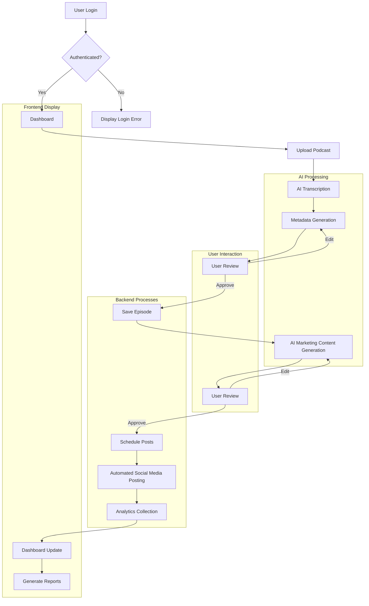
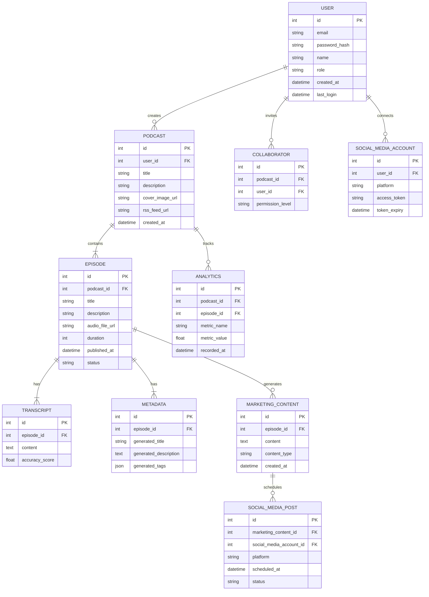
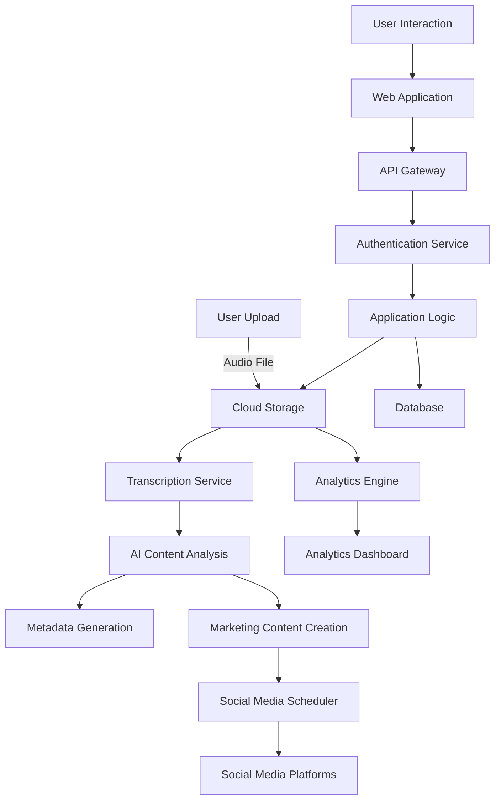

# 1. INTRODUCTION

## 1.1 PURPOSE

The purpose of this Software Requirements Specification (SRS) document is to provide a comprehensive and detailed description of the Podcast Marketing Automation SaaS platform. This document serves as a blueprint for the development team, project stakeholders, and quality assurance personnel, outlining the functional and non-functional requirements, system architecture, and design constraints of the software.

The intended audience for this SRS includes:

1. Development Team: To guide the implementation of features and functionalities
2. Project Managers: To plan and track project progress
3. Quality Assurance Team: To develop test plans and ensure the software meets specified requirements
4. Stakeholders and Decision Makers: To understand the scope and capabilities of the platform
5. Future Maintenance Teams: To comprehend the system architecture for updates and enhancements

This document will evolve throughout the development process, serving as a central reference point for all parties involved in the creation and deployment of the Podcast Marketing Automation SaaS platform.

## 1.2 SCOPE

The Podcast Marketing Automation SaaS platform is designed to revolutionize the podcast production and promotion workflow for creators. This cloud-based solution leverages artificial intelligence to automate time-consuming tasks, allowing podcast creators to focus on content creation while maximizing their reach and engagement.

### Goals:

1. Streamline the podcast production process
2. Automate marketing efforts across multiple social media platforms
3. Provide actionable insights through comprehensive analytics
4. Enhance podcast discoverability and audience growth

### Benefits:

1. Time Savings: Reduce manual effort in transcription, metadata generation, and marketing content creation
2. Consistency: Ensure regular and optimized social media presence
3. Improved Reach: Increase podcast visibility through AI-driven marketing strategies
4. Data-Driven Decisions: Enable creators to refine their content strategy based on performance metrics
5. Cost-Effective: Provide an all-in-one solution that replaces multiple standalone tools

### Core Functionalities:

1. Podcast Episode Management:
   - Audio file upload and storage
   - AI-powered transcription
   - Automated metadata generation (titles, descriptions, tags)

2. AI-Driven Marketing Automation:
   - Content generation for multiple social media platforms
   - Intelligent post scheduling
   - Dynamic content creation (quotes, hashtags, links)

3. Analytics Dashboard:
   - Episode performance metrics
   - Social media engagement tracking
   - Audience growth and retention analysis

4. User Management:
   - Secure authentication system
   - Role-based access control (Creator/Host and Collaborator roles)

5. Integration with Social Media Platforms:
   - OAuth-based connection to major platforms (LinkedIn, Facebook, X, Instagram)
   - Automated post distribution

6. Responsive Web Interface:
   - Modern, intuitive design
   - Support for both light and dark modes

The Podcast Marketing Automation SaaS platform will be developed using a modern technology stack, including React with TypeScript for the frontend, Django for the backend REST API, and leveraging cloud services for scalability and reliability. The system will integrate advanced AI models for natural language processing tasks and adhere to industry-standard security practices to protect user data and content.

By providing this comprehensive suite of tools and automations, the platform aims to empower podcast creators of all sizes to expand their reach, engage their audience more effectively, and streamline their production workflow.

# 2. PRODUCT DESCRIPTION

## 2.1 PRODUCT PERSPECTIVE

The Podcast Marketing Automation SaaS platform is a standalone, cloud-based solution designed to revolutionize the podcast production and marketing workflow. It integrates seamlessly with existing social media platforms and leverages cutting-edge AI technologies to provide a comprehensive suite of tools for podcast creators. The system operates within the broader ecosystem of content creation and digital marketing, filling a crucial gap between podcast production and audience engagement.

Key integration points include:

1. Social Media Platforms: Direct integration with LinkedIn, Facebook, X, and Instagram for automated content distribution.
2. Cloud Storage Services: Utilization of cloud infrastructure for secure and scalable audio file storage.
3. AI Services: Integration with advanced AI models for transcription, content analysis, and marketing content generation.
4. Analytics Tools: Connection to various data sources to provide comprehensive performance metrics.

The platform is designed as a web-based application, accessible through modern web browsers, eliminating the need for local software installation and ensuring cross-platform compatibility.

## 2.2 PRODUCT FUNCTIONS

The Podcast Marketing Automation SaaS platform offers the following primary functions:

1. Podcast Episode Management:
   - Audio file upload and storage
   - Episode metadata management (title, description, tags)
   - Publishing status control (draft, scheduled, published)

2. AI-Powered Transcription and Analysis:
   - Automated transcription of podcast episodes
   - Content analysis for keyword and topic extraction
   - Metadata suggestion based on transcript analysis

3. Marketing Content Generation:
   - AI-driven creation of social media posts
   - Dynamic content generation including quotes, hashtags, and links
   - Customization options for different social media platforms

4. Social Media Integration and Scheduling:
   - Connection to multiple social media accounts
   - Automated post scheduling and distribution
   - Calendar view for marketing content planning

5. Analytics and Reporting:
   - Episode performance tracking (downloads, engagement)
   - Social media metrics analysis
   - Custom report generation and data export

6. User Management and Collaboration:
   - Role-based access control
   - Team collaboration features for content review and approval

7. AI-Assisted SEO Optimization:
   - Keyword suggestion for episode titles and descriptions
   - Tag recommendations for improved discoverability

## 2.3 USER CHARACTERISTICS

The platform is designed to cater to a diverse range of podcast creators, from individual hobbyists to professional production teams. The primary user groups include:

1. Independent Podcast Creators:
   - Expertise: Varying levels, from beginners to experienced podcasters
   - Technical Skills: Basic to intermediate computer and internet skills
   - Needs: Time-saving tools, marketing assistance, growth strategies

2. Professional Podcast Producers:
   - Expertise: High level of podcasting and production knowledge
   - Technical Skills: Advanced understanding of audio production and digital marketing
   - Needs: Scalable solutions, team collaboration features, detailed analytics

3. Marketing Teams:
   - Expertise: Strong background in digital marketing and social media management
   - Technical Skills: Proficient in using various marketing tools and platforms
   - Needs: Efficient content distribution, performance tracking, campaign optimization

4. Content Managers:
   - Expertise: Experience in content strategy and management
   - Technical Skills: Familiarity with content management systems and analytics tools
   - Needs: Streamlined workflow, content planning features, performance insights

User Personas:

1. Sarah, the Solo Podcaster:
   - 28-year-old lifestyle blogger starting a podcast
   - Limited time for marketing, seeks automated solutions
   - Moderate technical skills, values user-friendly interfaces

2. Mark, the Podcast Network Producer:
   - 35-year-old managing multiple shows for a podcast network
   - Needs robust team collaboration and scalable marketing tools
   - High technical proficiency, requires detailed analytics and customization options

## 2.4 CONSTRAINTS

The development and operation of the Podcast Marketing Automation SaaS platform are subject to the following constraints:

1. Technical Constraints:
   - Must be developed using React with TypeScript for the frontend and Django for the backend
   - Required to support modern web browsers (Chrome, Firefox, Safari, Edge)
   - Mobile responsiveness is essential for all features

2. Regulatory Constraints:
   - Compliance with GDPR, CCPA, and other relevant data protection regulations
   - Adherence to social media platforms' terms of service and API usage policies

3. Security Constraints:
   - Implementation of industry-standard encryption for data at rest and in transit
   - Regular security audits and penetration testing required

4. Performance Constraints:
   - System must handle concurrent users as specified in performance requirements
   - AI transcription and content generation must complete within defined time limits

5. Integration Constraints:
   - Limited by the capabilities and restrictions of third-party APIs (social media platforms, AI services)

6. Budgetary Constraints:
   - Development and operational costs must remain within the allocated budget of $440,000

7. Time Constraints:
   - Project must be completed within the 9-month timeline as outlined in the project schedule

## 2.5 ASSUMPTIONS AND DEPENDENCIES

The following assumptions and dependencies are critical to the success of the project:

Assumptions:
1. The selected AI models will maintain or improve their accuracy throughout the development process.
2. Social media platforms will not implement significant API changes during the development phase.
3. The target user base has reliable internet connectivity and access to modern web browsers.
4. The freemium model will be sufficient to drive user adoption and generate revenue.
5. Cloud infrastructure costs will remain stable and within projected estimates.

Dependencies:
1. Availability and performance of third-party AI services for transcription and content generation.
2. Continued access to and stability of social media platform APIs.
3. Timely delivery of UI/UX designs to meet development milestones.
4. Availability of test data and sample podcasts for development and quality assurance.
5. Successful integration with cloud storage services for audio file management.
6. Timely completion of security audits and penetration testing by third-party vendors.
7. Availability of key team members throughout the project lifecycle.

These assumptions and dependencies will be continuously monitored and evaluated throughout the project to ensure timely risk mitigation and adjustment of strategies as needed.

Here's the PROCESS FLOWCHART section for the Podcast Marketing Automation SaaS platform using Mermaid JS, maintaining consistency with the previously mentioned technologies and frameworks:

# PROCESS FLOWCHART

The following flowchart illustrates the core processes of the Podcast Marketing Automation SaaS platform:

This flowchart represents the main processes of the Podcast Marketing Automation SaaS platform, from user authentication to report generation. Key components and their interactions are as follows:

1. User Authentication:
   - The process begins with user login, verifying credentials against the Django backend.

2. Dashboard Access:
   - Upon successful authentication, users are presented with the main dashboard built using React and TypeScript.

3. Podcast Upload and Processing:
   - Users upload podcast audio files (MP3 or WAV formats) to the platform.
   - The AI engine, integrated with the Django backend, performs transcription and metadata generation.

4. User Review and Editing:
   - Users can review and edit the AI-generated metadata through the React frontend interface.

5. AI Marketing Content Generation:
   - The AI engine creates marketing content for various social media platforms based on the podcast content.

6. Content Scheduling and Posting:
   - Users review and approve the generated content, which is then scheduled for posting.
   - The backend system handles automated posting to integrated social media platforms (LinkedIn, Facebook, X, Instagram).

7. Analytics and Reporting:
   - The system continuously collects performance data from both podcast downloads and social media engagement.
   - The dashboard is updated in real-time with this data, leveraging React for dynamic display.
   - Users can generate detailed reports based on collected analytics.

This flowchart demonstrates the seamless integration of frontend components (React, TypeScript), backend processes (Django), and AI services to provide a comprehensive podcast marketing automation solution. The user-centric design allows for easy interaction and control over the automated processes, ensuring quality and relevance of the published content.

Here's a breakdown of the Podcast Marketing Automation SaaS platform into features, maintaining consistency with the previously mentioned technologies and frameworks:

1. User Authentication and Management

ID: F001
DESCRIPTION: Secure user registration, login, and profile management system with role-based access control.
PRIORITY: High

| Requirement ID | Requirement Description |
|----------------|--------------------------|
| F001-1 | User registration with email verification |
| F001-2 | Secure login with multi-factor authentication option |
| F001-3 | User profile management (update personal information, change password) |
| F001-4 | Role-based access control (Creator/Host and Collaborator roles) |
| F001-5 | Password reset functionality |
| F001-6 | Session management with secure token-based authentication |

2. Podcast Episode Management

ID: F002
DESCRIPTION: Comprehensive system for uploading, storing, and managing podcast episodes and their metadata.
PRIORITY: High

| Requirement ID | Requirement Description |
|----------------|--------------------------|
| F002-1 | Audio file upload supporting MP3 and WAV formats |
| F002-2 | Cloud-based storage integration for audio files |
| F002-3 | Episode metadata management (title, description, tags) |
| F002-4 | Episode status control (draft, scheduled, published) |
| F002-5 | Batch upload functionality for multiple episodes |
| F002-6 | Episode organization with seasons and series support |

3. AI-Powered Transcription and Metadata Creation

ID: F003
DESCRIPTION: Automated transcription of podcast episodes and AI-driven metadata generation.
PRIORITY: High

| Requirement ID | Requirement Description |
|----------------|--------------------------|
| F003-1 | AI-powered transcription with >95% accuracy |
| F003-2 | Editable transcript interface for user corrections |
| F003-3 | AI-generated episode titles based on content |
| F003-4 | AI-suggested episode descriptions and tags |
| F003-5 | Keyword extraction for SEO optimization |
| F003-6 | Language detection and support for multiple languages |

4. Social Media Marketing Integration

ID: F004
DESCRIPTION: AI-generated marketing content creation and scheduling for major social media platforms.
PRIORITY: High

| Requirement ID | Requirement Description |
|----------------|--------------------------|
| F004-1 | AI-generated marketing posts for LinkedIn, Facebook, X, and Instagram |
| F004-2 | Social media account linking with OAuth |
| F004-3 | Post scheduling functionality with calendar interface |
| F004-4 | Dynamic content generation (quotes, hashtags, links) |
| F004-5 | Customizable post templates for brand consistency |
| F004-6 | Bulk scheduling for marketing campaigns |

5. Analytics Dashboard

ID: F005
DESCRIPTION: Comprehensive analytics interface for tracking podcast performance and marketing effectiveness.
PRIORITY: Medium

| Requirement ID | Requirement Description |
|----------------|--------------------------|
| F005-1 | Episode performance metrics (downloads, listens, engagement) |
| F005-2 | Social media metrics (reach, engagement, click-throughs) |
| F005-3 | Customizable date ranges for reporting |
| F005-4 | Visual data representation (graphs, charts) |
| F005-5 | Export functionality for reports (CSV, PDF) |
| F005-6 | Real-time data updates and notifications |

6. User Interface and Experience

ID: F006
DESCRIPTION: Responsive and intuitive user interface with modern design principles.
PRIORITY: Medium

| Requirement ID | Requirement Description |
|----------------|--------------------------|
| F006-1 | Responsive design for desktop and mobile devices |
| F006-2 | Light and dark mode support |
| F006-3 | Left-side navigation bar with main sections |
| F006-4 | Drag-and-drop functionality for content organization |
| F006-5 | Keyboard shortcuts for power users |
| F006-6 | Customizable dashboard widgets |

7. AI Content Optimization

ID: F007
DESCRIPTION: AI-driven tools for optimizing podcast content and marketing strategies.
PRIORITY: Medium

| Requirement ID | Requirement Description |
|----------------|--------------------------|
| F007-1 | AI-suggested content improvements based on analytics |
| F007-2 | Automated A/B testing for marketing content |
| F007-3 | Sentiment analysis of user comments and feedback |
| F007-4 | Trend analysis for topic suggestions |
| F007-5 | AI-generated show notes and episode summaries |
| F007-6 | Competitive analysis based on industry podcasts |

8. Collaboration and Workflow

ID: F008
DESCRIPTION: Tools and features to support team collaboration and streamline the podcast production workflow.
PRIORITY: Low

| Requirement ID | Requirement Description |
|----------------|--------------------------|
| F008-1 | Task assignment and tracking for team members |
| F008-2 | Collaborative editing of transcripts and metadata |
| F008-3 | Approval workflows for content publishing |
| F008-4 | In-app messaging and notification system |
| F008-5 | Shared calendar for episode and marketing schedules |
| F008-6 | Version control for episode drafts and marketing content |

9. Integration and API

ID: F009
DESCRIPTION: API access and third-party integrations to extend platform functionality.
PRIORITY: Low

| Requirement ID | Requirement Description |
|----------------|--------------------------|
| F009-1 | RESTful API for third-party integrations |
| F009-2 | Webhook support for real-time data synchronization |
| F009-3 | Integration with popular podcast hosting platforms |
| F009-4 | Connection to email marketing tools |
| F009-5 | Integration with project management software |
| F009-6 | Support for custom integrations via Zapier or similar services |

10. Security and Compliance

ID: F010
DESCRIPTION: Robust security measures and compliance with data protection regulations.
PRIORITY: High

| Requirement ID | Requirement Description |
|----------------|--------------------------|
| F010-1 | End-to-end encryption for sensitive data |
| F010-2 | Regular security audits and penetration testing |
| F010-3 | GDPR and CCPA compliance features |
| F010-4 | Two-factor authentication (2FA) for user accounts |
| F010-5 | Audit logs for all system actions |
| F010-6 | Data backup and recovery procedures |

These features are designed to be implemented using the previously specified technology stack, including React with TypeScript for the frontend, Django for the backend REST API, and leveraging cloud services for scalability and reliability. The AI components will integrate with advanced models like GPT for natural language processing tasks, ensuring cutting-edge capabilities in transcription, content analysis, and marketing content generation.

# NON-FUNCTIONAL REQUIREMENTS

## PERFORMANCE

1. Response Time:
   - Web application pages should load within 2 seconds under normal network conditions.
   - API endpoints should respond within 500ms for 95% of requests.
   - AI transcription should complete within 2x the duration of the audio file.

2. Throughput:
   - The system should support at least 1000 concurrent users without degradation in performance.
   - The platform should handle up to 100 simultaneous podcast uploads.

3. Resource Usage:
   - CPU utilization should not exceed 70% under normal load.
   - Memory usage should be optimized to not exceed 4GB per server instance.
   - Database queries should be optimized to execute within 100ms for 90% of requests.

## SAFETY

1. Data Backup:
   - Automated daily backups of all user data and content.
   - Ability to restore from backups within 4 hours in case of data loss.

2. Fault Tolerance:
   - Implement redundancy for critical system components to ensure 99.9% uptime.
   - Graceful degradation of non-critical features during partial system failures.

3. Error Handling:
   - Comprehensive error logging and monitoring system.
   - Automated alerts for critical system errors to the development team.

4. Data Integrity:
   - Implement data validation checks to prevent corruption during transmission or storage.
   - Use checksums to verify the integrity of uploaded audio files.

## SECURITY

1. Authentication:
   - Multi-factor authentication (MFA) support for user accounts.
   - Secure password policies enforcing minimum length and complexity.

2. Authorization:
   - Role-based access control (RBAC) for different user types (Creator/Host, Collaborator).
   - Fine-grained permissions for accessing and modifying podcast content.

3. Data Encryption:
   - Use of TLS 1.3 for all data in transit.
   - AES-256 encryption for all sensitive data at rest.

4. Privacy:
   - Compliance with GDPR and CCPA regulations for user data protection.
   - Provide users with the ability to export and delete their data.

5. API Security:
   - Implementation of OAuth 2.0 for secure API access.
   - Rate limiting to prevent API abuse.

6. Vulnerability Management:
   - Regular security audits and penetration testing.
   - Timely application of security patches to all system components.

## QUALITY

1. Availability:
   - 99.9% uptime for core services (excluding scheduled maintenance).
   - Maximum of 4 hours of planned downtime per month for maintenance.

2. Maintainability:
   - Well-documented codebase following best practices for React and Django.
   - Modular architecture to facilitate easy updates and feature additions.
   - Automated CI/CD pipeline for streamlined deployment processes.

3. Usability:
   - Intuitive user interface with a maximum learning curve of 1 hour for basic functions.
   - Support for keyboard shortcuts for power users.
   - Compliance with WCAG 2.1 Level AA for accessibility.

4. Scalability:
   - Horizontal scalability to support up to 1 million registered users.
   - Ability to scale AI processing capabilities based on demand.
   - Cloud-native architecture leveraging containerization for easy scaling.

5. Reliability:
   - Mean Time Between Failures (MTBF) of at least 720 hours.
   - Mean Time To Repair (MTTR) of less than 2 hours for critical issues.
   - Automated system health checks and self-healing mechanisms where possible.

## COMPLIANCE

1. Legal:
   - Compliance with intellectual property laws for user-generated content.
   - Adherence to licensing requirements for all third-party libraries and services.

2. Regulatory:
   - GDPR compliance for handling personal data of EU citizens.
   - CCPA compliance for California residents' data protection.
   - COPPA compliance to protect children's privacy (if applicable).

3. Standards:
   - Adherence to OAuth 2.0 standards for authentication and authorization.
   - Compliance with PCI DSS for handling payment information (for premium subscriptions).
   - Implementation of WCAG 2.1 Level AA for web accessibility.

4. Industry-Specific:
   - Compliance with IAB Podcast Measurement Guidelines for analytics reporting.
   - Adherence to RSS 2.0 specification for podcast feed generation.

5. Data Retention:
   - Implementation of data retention policies in line with legal requirements.
   - Secure data destruction processes for deleted user accounts and content.

6. Audit Trail:
   - Maintenance of comprehensive logs for all system activities and user actions.
   - Ability to provide audit trails for compliance investigations when required.

These non-functional requirements ensure that the Podcast Marketing Automation SaaS platform not only meets its functional goals but also delivers a secure, performant, and high-quality user experience while adhering to relevant legal and industry standards. The requirements are aligned with the previously specified technology stack, including React with TypeScript for the frontend, Django for the backend, and cloud-based infrastructure for scalability and reliability.

# DATA REQUIREMENTS

## DATA MODELS

The Podcast Marketing Automation SaaS platform will utilize the following data models to represent the core entities and their relationships:

This entity-relationship diagram represents the core data structure of the platform, showcasing the relationships between users, podcasts, episodes, transcripts, marketing content, and analytics.

## DATA STORAGE

The Podcast Marketing Automation SaaS platform will implement a robust data storage strategy to ensure data integrity, availability, and scalability:

1. Database Management System:
   - Primary database: PostgreSQL for structured data storage
   - Redis for caching and session management

2. File Storage:
   - Cloud object storage (e.g., Amazon S3 or Google Cloud Storage) for audio files, images, and large text data (transcripts)

3. Data Retention:
   - User account data: Retained for the lifetime of the account, with an option for users to request data deletion
   - Podcast and episode data: Retained indefinitely while the account is active
   - Analytics data: Aggregated after 12 months for long-term storage efficiency
   - Marketing content: Retained for 6 months after creation, then archived

4. Redundancy:
   - Database replication with at least one primary and two secondary nodes
   - Multi-region data replication for cloud object storage

5. Backup:
   - Daily incremental backups of the database
   - Weekly full backups of all data
   - Backups stored in a separate geographic region from the primary data
   - Retention of backups for 30 days

6. Recovery:
   - Automated failover to secondary database nodes in case of primary node failure
   - Ability to restore from backups with a Recovery Time Objective (RTO) of 4 hours
   - Regular disaster recovery drills to ensure process effectiveness

7. Scalability:
   - Horizontal scaling of database read replicas to handle increased query load
   - Auto-scaling of application servers based on traffic patterns
   - Use of content delivery networks (CDNs) for efficient delivery of audio files and images

## DATA PROCESSING

The platform will implement secure and efficient data processing workflows to handle various aspects of podcast management and marketing automation:

1. Data Security:
   - Encryption at rest using AES-256 for all stored data
   - Encryption in transit using TLS 1.3 for all data transfers
   - Regular security audits and penetration testing
   - Implementation of access controls and least privilege principles
   - Secure key management using a dedicated key management service

2. Data Flow:

3. Data Processing Workflows:

   a. Podcast Upload and Processing:
      - User uploads audio file through web interface
      - File is securely transferred to cloud storage
      - Transcription service processes the audio file
      - AI content analysis extracts key topics and sentiment
      - Metadata is generated based on content analysis
      - Transcript and metadata are stored in the database

   b. Marketing Content Generation:
      - AI engine analyzes transcript and metadata
      - Marketing content is generated for various social media platforms
      - Content is presented to user for review and approval
      - Approved content is scheduled for posting

   c. Analytics Processing:
      - Raw data is collected from various sources (podcast hosting, social media APIs)
      - Data is processed and aggregated in real-time
      - Aggregated data is stored in the database
      - Analytics dashboard retrieves and displays processed data

4. Data Integrity:
   - Implementation of database transactions for critical operations
   - Data validation at both client and server levels
   - Periodic data integrity checks and reconciliation

5. Compliance:
   - Implementation of data anonymization techniques for analytics
   - Data processing in compliance with GDPR, CCPA, and other relevant regulations
   - Maintenance of detailed logs for all data processing activities

6. Performance Optimization:
   - Use of caching mechanisms to reduce database load
   - Asynchronous processing of non-critical tasks
   - Batch processing for large-scale data operations

By implementing these data requirements, the Podcast Marketing Automation SaaS platform ensures secure, efficient, and scalable handling of user data, podcast content, and marketing materials, while providing robust analytics and maintaining regulatory compliance.

# EXTERNAL INTERFACES

## USER INTERFACES

The Podcast Marketing Automation SaaS platform will feature a responsive web-based user interface accessible through modern web browsers. The interface will be developed using React with TypeScript and styled using TailwindCSS and ShadCN components, ensuring a consistent and intuitive user experience across devices.

Key aspects of the user interface include:

1. Dashboard:
   - Overview of podcast performance metrics
   - Quick access to recent episodes and scheduled marketing content
   - Notifications for important events (e.g., successful transcriptions, scheduled posts)

2. Episode Management:
   - List view of all episodes with filtering and sorting options
   - Drag-and-drop interface for audio file uploads
   - Inline editing of episode metadata

3. Transcription and Metadata Editor:
   - Side-by-side view of audio player and transcription text
   - Highlighting of AI-generated metadata suggestions
   - Easy-to-use editing tools for transcript correction

4. Marketing Content Generator:
   - Preview of AI-generated content for different social media platforms
   - Customization options for adjusting generated content
   - Calendar view for scheduling posts

5. Analytics Dashboard:
   - Interactive charts and graphs for visualizing performance data
   - Customizable date range selectors
   - Export functionality for reports

6. Settings and Account Management:
   - User profile management
   - Social media account connections
   - Subscription and billing information

The interface will support both light and dark modes, automatically switching based on user OS/browser settings. Accessibility features will be implemented to ensure WCAG 2.1 Level AA compliance.

[Placeholder for UI mockups]

## SOFTWARE INTERFACES

The Podcast Marketing Automation SaaS platform will interact with various external software systems and components:

1. AI Services:
   - Interface: RESTful API
   - Purpose: Transcription, content analysis, and marketing content generation
   - Data Format: JSON
   - Communication Protocol: HTTPS

2. Social Media Platforms:
   - Interfaces: OAuth 2.0 for authentication, Platform-specific APIs
   - Platforms: LinkedIn, Facebook, X (Twitter), Instagram
   - Purpose: Account linking, content posting, analytics retrieval
   - Data Format: JSON
   - Communication Protocol: HTTPS

3. Cloud Storage Service:
   - Interface: S3-compatible API
   - Purpose: Storage and retrieval of audio files and generated content
   - Data Format: Binary (audio files), JSON (metadata)
   - Communication Protocol: HTTPS

4. Payment Gateway:
   - Interface: RESTful API
   - Purpose: Processing subscription payments and managing billing
   - Data Format: JSON
   - Communication Protocol: HTTPS with PCI DSS compliance

5. Email Service Provider:
   - Interface: SMTP or provider-specific API
   - Purpose: Sending transactional emails and notifications
   - Data Format: MIME for emails, JSON for API interactions
   - Communication Protocol: SMTP (TLS) or HTTPS

6. Analytics Service:
   - Interface: RESTful API or SDK
   - Purpose: Collecting and processing user behavior data
   - Data Format: JSON
   - Communication Protocol: HTTPS

7. Content Delivery Network (CDN):
   - Interface: CDN-specific API
   - Purpose: Caching and delivering static assets and audio files
   - Data Format: Various (HTML, CSS, JavaScript, audio files)
   - Communication Protocol: HTTPS

## COMMUNICATION INTERFACES

The Podcast Marketing Automation SaaS platform will utilize the following communication interfaces:

1. HTTP/HTTPS:
   - Primary protocol for all web-based communications
   - Used for API interactions, web socket connections, and serving web content
   - TLS 1.3 encryption required for all HTTPS communications

2. WebSocket:
   - Used for real-time updates in the user interface
   - Secure WebSocket (WSS) protocol implemented for encrypted communications

3. OAuth 2.0:
   - Used for authenticating with social media platforms and other third-party services
   - Implements standard OAuth 2.0 flow for secure token exchange

4. REST APIs:
   - Used for communication between frontend and backend services
   - JSON format for data exchange
   - Implements standard HTTP methods (GET, POST, PUT, DELETE)

5. GraphQL:
   - Optional interface for more efficient data querying and manipulation
   - Implemented alongside REST APIs to provide flexibility for future scaling

6. SMTP:
   - Used for sending email notifications and transactional emails
   - TLS encryption required for all SMTP communications

7. WebRTC:
   - Potential future implementation for peer-to-peer audio streaming features

Data Formats:
- JSON: Primary format for data exchange in APIs
- XML: Supported for RSS feed generation and consumption
- MIME: Used for email content structuring
- Binary: Used for audio file uploads and downloads

Interaction Methods:
- Asynchronous communication for non-blocking operations
- Rate limiting implemented on APIs to prevent abuse
- Pagination for large data sets to optimize performance
- Caching mechanisms to reduce server load and improve response times

Security Measures:
- All external communications encrypted using TLS 1.3
- API authentication using JWT (JSON Web Tokens)
- CORS (Cross-Origin Resource Sharing) policies implemented to restrict unauthorized access
- Regular security audits and penetration testing of all communication interfaces

These communication interfaces ensure secure, efficient, and standardized interactions between the Podcast Marketing Automation SaaS platform and external systems, providing a robust foundation for the application's functionality and future scalability.

# APPENDICES

## GLOSSARY

- **AI**: Artificial Intelligence, referring to the simulation of human intelligence in machines programmed to think and learn like humans.
- **CDN**: Content Delivery Network, a geographically distributed group of servers that work together to provide fast delivery of Internet content.
- **Freemium**: A pricing strategy that offers a basic version of a product or service for free while charging for premium features.
- **Metadata**: Data that provides information about other data, in this context, information about podcast episodes such as title, description, and tags.
- **OAuth**: Open Authorization, an open standard for access delegation, commonly used as a way for Internet users to grant websites or applications access to their information on other websites but without giving them the passwords.
- **Podcast**: A digital audio file made available on the Internet for downloading to a computer or mobile device, typically available as a series.
- **SaaS**: Software as a Service, a software licensing and delivery model in which software is licensed on a subscription basis and is centrally hosted.
- **Transcription**: The process of converting speech from a video or audio format into written text.

## ACRONYMS

- **API**: Application Programming Interface
- **CCPA**: California Consumer Privacy Act
- **CI/CD**: Continuous Integration/Continuous Deployment
- **CSS**: Cascading Style Sheets
- **GDPR**: General Data Protection Regulation
- **HTML**: Hypertext Markup Language
- **JSON**: JavaScript Object Notation
- **JWT**: JSON Web Token
- **MFA**: Multi-Factor Authentication
- **NLP**: Natural Language Processing
- **PCI DSS**: Payment Card Industry Data Security Standard
- **REST**: Representational State Transfer
- **SMTP**: Simple Mail Transfer Protocol
- **SQL**: Structured Query Language
- **SSL**: Secure Sockets Layer
- **TLS**: Transport Layer Security
- **UI/UX**: User Interface/User Experience
- **WCAG**: Web Content Accessibility Guidelines

## ADDITIONAL REFERENCES

1. React Documentation: https://reactjs.org/docs/getting-started.html
2. Django Documentation: https://docs.djangoproject.com/
3. TypeScript Handbook: https://www.typescriptlang.org/docs/
4. TailwindCSS Documentation: https://tailwindcss.com/docs
5. OAuth 2.0 Specification: https://oauth.net/2/
6. GDPR Official Text: https://gdpr-info.eu/
7. CCPA Official Resource: https://oag.ca.gov/privacy/ccpa
8. Web Content Accessibility Guidelines (WCAG) 2.1: https://www.w3.org/TR/WCAG21/
9. JSON Web Token (JWT) Introduction: https://jwt.io/introduction/
10. RESTful API Design Best Practices: https://restfulapi.net/
11. Cloud Security Alliance Guidelines: https://cloudsecurityalliance.org/research/guidance/
12. Podcast Measurement Technical Guidelines by IAB: https://iabtechlab.com/standards/podcast-measurement-guidelines/
13. GPT-3 API Documentation: https://beta.openai.com/docs/
14. Social Media API Documentation:
    - Facebook Graph API: https://developers.facebook.com/docs/graph-api/
    - Twitter API: https://developer.twitter.com/en/docs
    - LinkedIn API: https://developer.linkedin.com/docs
    - Instagram Graph API: https://developers.facebook.com/docs/instagram-api/
15. AWS S3 Documentation (for cloud storage): https://docs.aws.amazon.com/s3/index.html
16. Redis Documentation (for caching): https://redis.io/documentation
17. PostgreSQL Documentation: https://www.postgresql.org/docs/

These additional references provide in-depth information on the technologies, frameworks, and standards relevant to the development and compliance of the Podcast Marketing Automation SaaS platform.