# 1. INTRODUCTION

## 1.1 SYSTEM OVERVIEW

The Podcast Marketing Automation SaaS platform is a comprehensive, cloud-based solution designed to streamline the podcast production and marketing workflow for creators of all sizes. This system leverages cutting-edge AI technologies to automate time-consuming tasks, allowing podcast creators to focus on content creation while maximizing their reach and engagement.

### High-Level Architecture

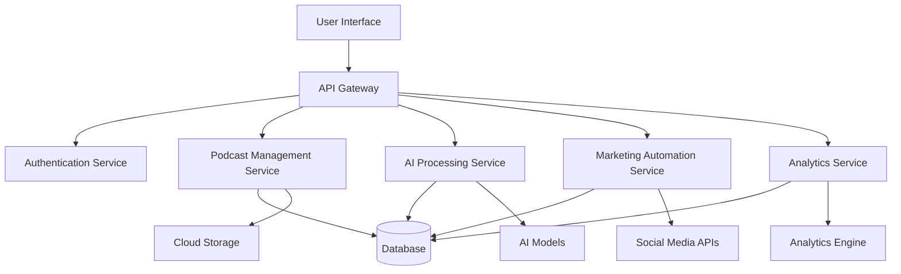

### Key Components

1. **User Interface**: A responsive web application built with React and TypeScript, styled using TailwindCSS and ShadCN components. It provides an intuitive interface for podcast management, content creation, and analytics visualization.

2. **API Gateway**: Manages and routes API requests, handling authentication, rate limiting, and request/response transformations.

3. **Authentication Service**: Implements secure user authentication and authorization using JWT tokens and supports multi-factor authentication.

4. **Podcast Management Service**: Handles core functionalities related to podcast episode creation, metadata management, and audio file processing.

5. **AI Processing Service**: Integrates with advanced AI models to provide transcription, content analysis, and marketing content generation capabilities.

6. **Marketing Automation Service**: Manages the creation, scheduling, and distribution of marketing content across various social media platforms.

7. **Analytics Service**: Collects, processes, and presents performance data from podcast hosting platforms and social media channels.

8. **Database**: Utilizes PostgreSQL for structured data storage, ensuring data integrity and efficient querying.

9. **Cloud Storage**: Leverages cloud object storage (e.g., Amazon S3) for secure and scalable storage of audio files and large text data.

10. **AI Models**: Incorporates state-of-the-art natural language processing models like GPT for content generation and analysis.

11. **Social Media APIs**: Integrates with major social media platforms (LinkedIn, Facebook, X, Instagram) for automated content distribution and analytics retrieval.

12. **Analytics Engine**: Processes raw data to generate actionable insights and visualizations for the analytics dashboard.

### Key Features

1. AI-powered podcast transcription and metadata generation
2. Automated marketing content creation for multiple social media platforms
3. Intelligent post scheduling and distribution
4. Comprehensive analytics dashboard for podcast and marketing performance
5. Collaborative tools for team-based podcast production
6. Scalable cloud infrastructure to support growing user base

### Technology Stack

- Frontend: React with TypeScript, TailwindCSS, ShadCN
- Backend: Django (Python) for RESTful API development
- Database: PostgreSQL
- Caching: Redis
- AI/ML: Integration with GPT and custom NLP models
- Cloud Services: AWS or Google Cloud Platform for hosting and storage
- CI/CD: GitLab CI or GitHub Actions for automated testing and deployment

This system overview provides a high-level understanding of the Podcast Marketing Automation SaaS platform's architecture, key components, features, and technology stack. The platform is designed to be scalable, secure, and user-friendly, catering to the diverse needs of podcast creators while leveraging advanced AI capabilities to automate and optimize the podcast production and marketing process.

# SYSTEM ARCHITECTURE

## PROGRAMMING LANGUAGES

The Podcast Marketing Automation SaaS platform will utilize the following programming languages:

| Language   | Purpose                                   | Justification                                                                                                   |
|------------|-------------------------------------------|------------------------------------------------------------------------------------------------------------------|
| TypeScript | Frontend development                      | Provides static typing for JavaScript, enhancing code quality and developer productivity in the React ecosystem |
| Python     | Backend development                       | Powers the Django framework, offering robust libraries for AI integration and data processing                   |
| SQL        | Database queries                          | Essential for interacting with the PostgreSQL database, ensuring efficient data retrieval and manipulation      |
| HTML/CSS   | Frontend markup and styling               | Standard languages for web content structure and presentation, used in conjunction with React components        |
| JavaScript | Client-side scripting and Node.js tooling | Supports React ecosystem and enables server-side rendering for improved performance                              |

## HIGH-LEVEL ARCHITECTURE DIAGRAM

The following diagram provides an overview of the system's components and their interactions:

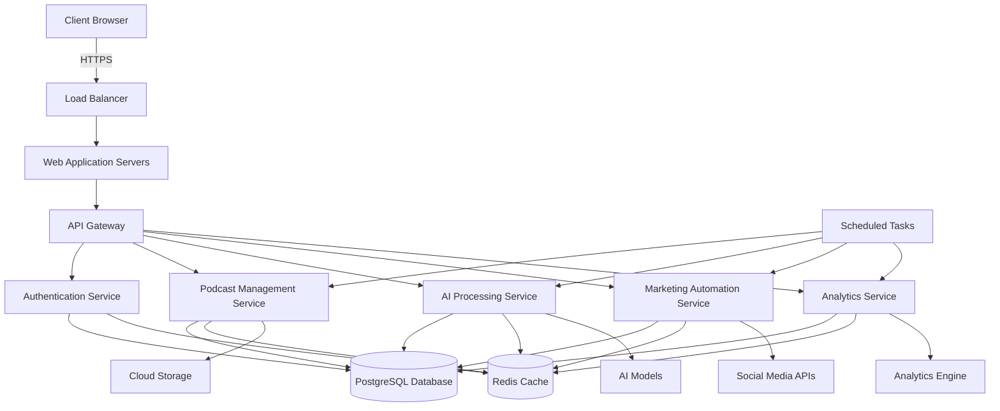

## COMPONENT DIAGRAMS

### Podcast Management Service

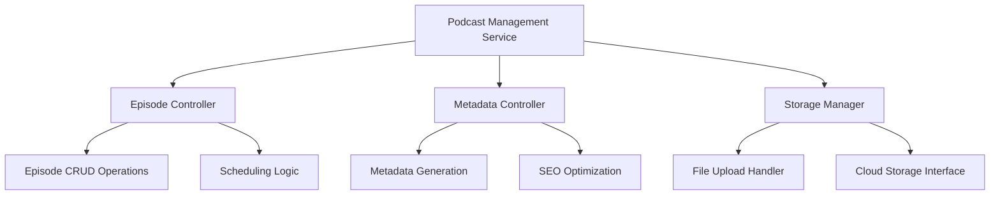

### AI Processing Service

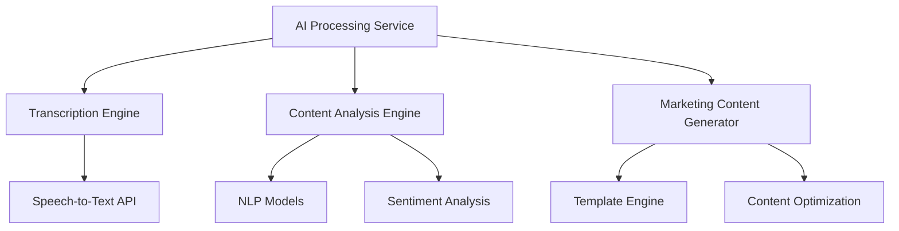

## SEQUENCE DIAGRAMS

### Podcast Upload and Processing

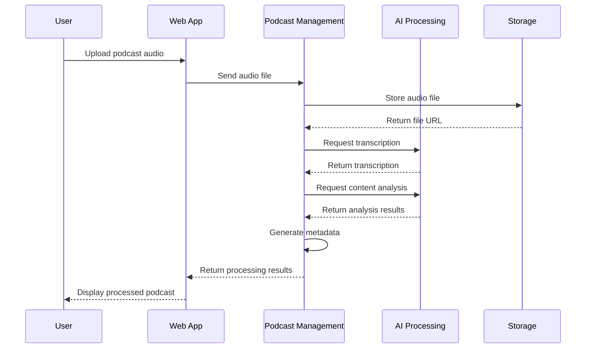

### Marketing Content Generation and Scheduling

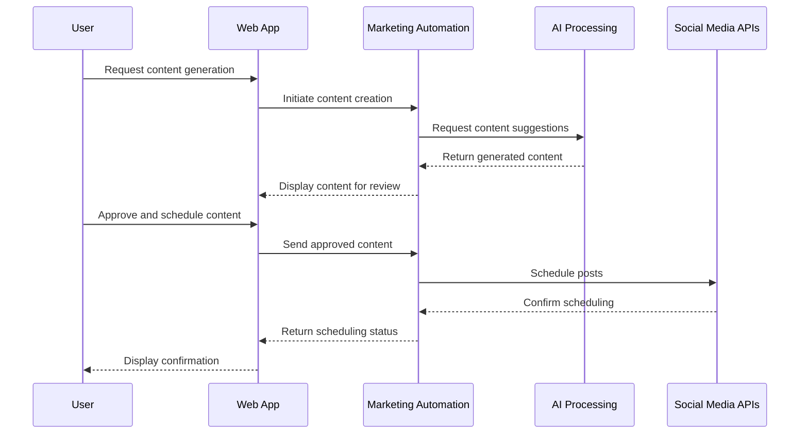

## DATA-FLOW DIAGRAM

The following diagram illustrates how information moves through the Podcast Marketing Automation SaaS platform:

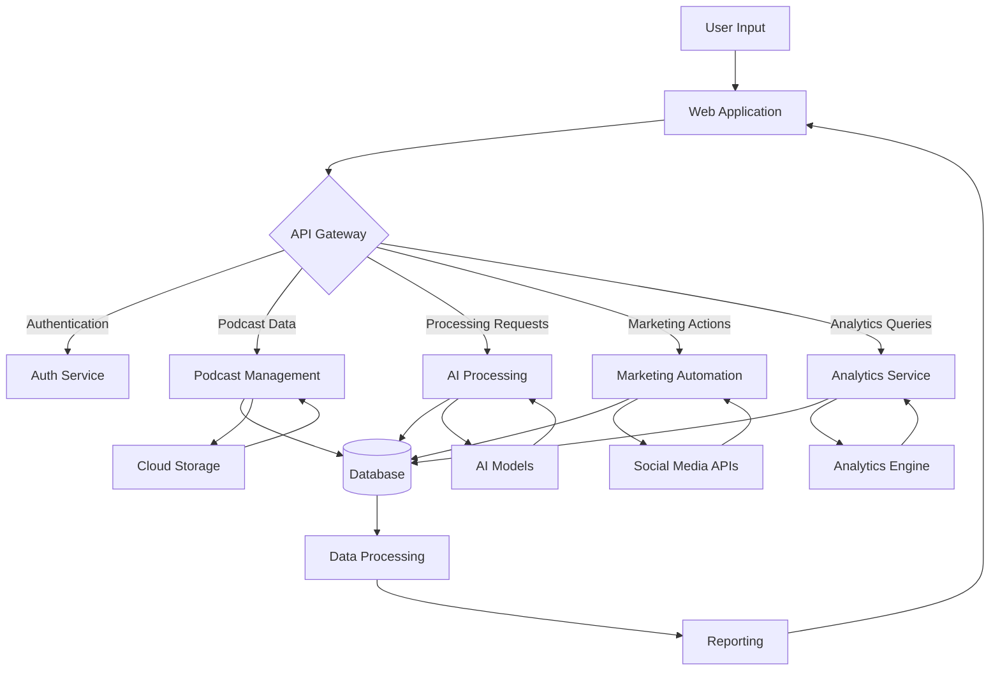

In this data flow:

1. User input enters the system through the web application.
2. The API gateway routes requests to appropriate services.
3. Each service interacts with the central database and its specific external components (e.g., cloud storage, AI models).
4. Data is processed and stored in the database.
5. The analytics engine continuously processes data for reporting.
6. Processed information flows back to the user through the web application.

This architecture ensures efficient data handling, processing, and flow throughout the system, supporting the complex operations required for podcast management, AI-driven content generation, and marketing automation.

# SYSTEM DESIGN

## PROGRAMMING LANGUAGES

The Podcast Marketing Automation SaaS platform will utilize the following programming languages:

| Language   | Purpose                                   | Justification                                                                                                   |
|------------|-------------------------------------------|------------------------------------------------------------------------------------------------------------------|
| TypeScript | Frontend development                      | Provides static typing for JavaScript, enhancing code quality and developer productivity in the React ecosystem |
| Python     | Backend development                       | Powers the Django framework, offering robust libraries for AI integration and data processing                   |
| SQL        | Database queries                          | Essential for interacting with the PostgreSQL database, ensuring efficient data retrieval and manipulation      |
| HTML/CSS   | Frontend markup and styling               | Standard languages for web content structure and presentation, used in conjunction with React components        |
| JavaScript | Client-side scripting and Node.js tooling | Supports React ecosystem and enables server-side rendering for improved performance                              |

## DATABASE DESIGN

The Podcast Marketing Automation SaaS platform will use PostgreSQL as the primary relational database. The database schema is designed to efficiently store and retrieve data for podcasts, episodes, users, and marketing content.

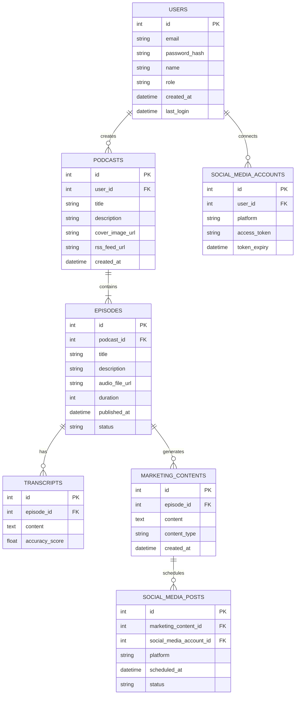

This schema design ensures efficient data storage and retrieval while maintaining the relationships between different entities in the system.

## API DESIGN

The Podcast Marketing Automation SaaS platform will implement a RESTful API using Django REST Framework. The API will follow best practices for versioning, authentication, and error handling.

Key API endpoints:

1. Authentication
   - POST /api/v1/auth/login
   - POST /api/v1/auth/logout
   - POST /api/v1/auth/refresh-token

2. Podcasts
   - GET /api/v1/podcasts
   - POST /api/v1/podcasts
   - GET /api/v1/podcasts/{id}
   - PUT /api/v1/podcasts/{id}
   - DELETE /api/v1/podcasts/{id}

3. Episodes
   - GET /api/v1/podcasts/{podcast_id}/episodes
   - POST /api/v1/podcasts/{podcast_id}/episodes
   - GET /api/v1/episodes/{id}
   - PUT /api/v1/episodes/{id}
   - DELETE /api/v1/episodes/{id}

4. Transcripts
   - GET /api/v1/episodes/{episode_id}/transcript
   - POST /api/v1/episodes/{episode_id}/transcript
   - PUT /api/v1/episodes/{episode_id}/transcript

5. Marketing Content
   - GET /api/v1/episodes/{episode_id}/marketing-content
   - POST /api/v1/episodes/{episode_id}/marketing-content
   - PUT /api/v1/marketing-content/{id}
   - DELETE /api/v1/marketing-content/{id}

6. Social Media Posts
   - GET /api/v1/marketing-content/{content_id}/social-posts
   - POST /api/v1/marketing-content/{content_id}/social-posts
   - PUT /api/v1/social-posts/{id}
   - DELETE /api/v1/social-posts/{id}

7. Analytics
   - GET /api/v1/podcasts/{podcast_id}/analytics
   - GET /api/v1/episodes/{episode_id}/analytics

API Authentication:
- JWT (JSON Web Tokens) for secure authentication
- OAuth 2.0 for social media platform integrations

Error Handling:
- Consistent error response format
- Appropriate HTTP status codes
- Detailed error messages for debugging

Rate Limiting:
- Implement rate limiting to prevent API abuse

Documentation:
- Use Swagger/OpenAPI for comprehensive API documentation

## USER INTERFACE DESIGN

The user interface for the Podcast Marketing Automation SaaS platform will be built using React with TypeScript, styled with TailwindCSS and ShadCN components. The design will focus on intuitive navigation, clean aesthetics, and responsive layouts for various device sizes.

Key UI components:

1. Dashboard
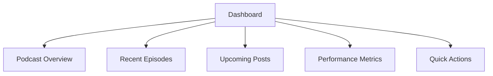

2. Podcast Management
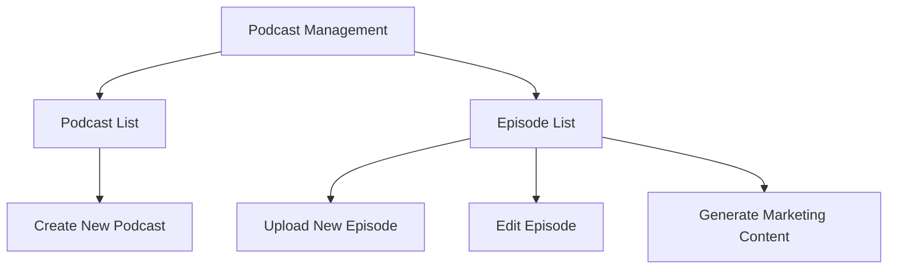

3. Marketing Content Generator
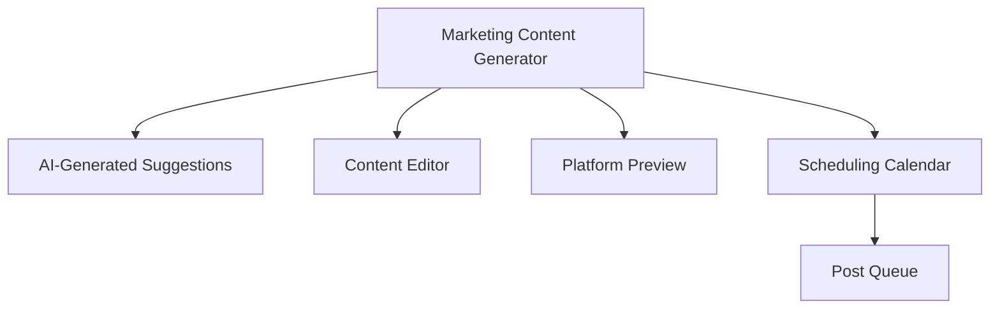

4. Analytics Dashboard
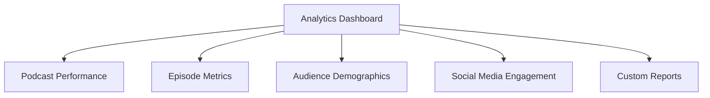

Design Principles:
- Consistent color scheme and typography across all pages
- Intuitive navigation with a left-side menu bar
- Responsive design for desktop, tablet, and mobile devices
- Accessibility compliance with WCAG 2.1 Level AA standards
- Support for both light and dark modes

Interactive Elements:
- Drag-and-drop interfaces for content organization
- Real-time previews for marketing content generation
- Interactive charts and graphs for analytics visualization
- Modal dialogs for quick actions and confirmations

Feedback and Notifications:
- Toast notifications for system messages and alerts
- Progress indicators for long-running processes (e.g., audio transcription)
- Inline validation for form inputs

The user interface design will prioritize user experience, ensuring that podcast creators can efficiently manage their content, generate marketing materials, and analyze performance metrics with minimal friction.

# TECHNOLOGY STACK

## PROGRAMMING LANGUAGES

The Podcast Marketing Automation SaaS platform will utilize the following programming languages:

| Language   | Purpose                                   | Justification                                                                                                   |
|------------|-------------------------------------------|------------------------------------------------------------------------------------------------------------------|
| TypeScript | Frontend development                      | Provides static typing for JavaScript, enhancing code quality and developer productivity in the React ecosystem |
| Python     | Backend development                       | Powers the Django framework, offering robust libraries for AI integration and data processing                   |
| SQL        | Database queries                          | Essential for interacting with the PostgreSQL database, ensuring efficient data retrieval and manipulation      |
| HTML/CSS   | Frontend markup and styling               | Standard languages for web content structure and presentation, used in conjunction with React components        |
| JavaScript | Client-side scripting and Node.js tooling | Supports React ecosystem and enables server-side rendering for improved performance                              |

## FRAMEWORKS AND LIBRARIES

The following frameworks and libraries will be utilized in the development of the platform:

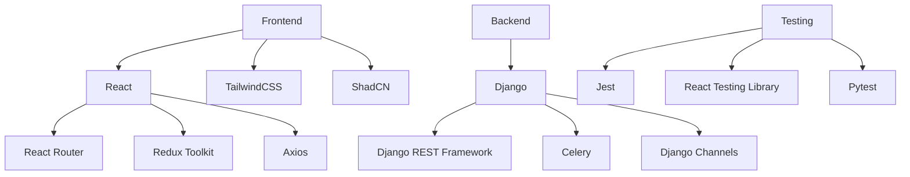

Additional libraries and tools:

- Webpack: Module bundler for frontend assets
- ESLint & Prettier: Code linting and formatting
- Black & isort: Python code formatting
- Sentry: Error tracking and performance monitoring
- Swagger/OpenAPI: API documentation

## DATABASES

The platform will employ the following database systems:

1. Primary Database: PostgreSQL
   - Purpose: Store structured data (user accounts, podcast metadata, analytics)
   - Justification: Robust, scalable, and supports complex queries and transactions

2. Caching Layer: Redis
   - Purpose: Session management, caching frequently accessed data
   - Justification: In-memory data structure store, providing high-performance caching

3. Search Engine: Elasticsearch
   - Purpose: Full-text search capabilities for podcast content and transcripts
   - Justification: Optimized for fast and efficient text-based searches

4. Time-Series Database: InfluxDB
   - Purpose: Store and query time-series data for analytics
   - Justification: Optimized for handling time-stamped data, ideal for metrics and analytics

## THIRD-PARTY SERVICES

The platform will integrate the following external services and APIs:

1. Cloud Infrastructure:
   - Amazon Web Services (AWS) or Google Cloud Platform (GCP)
   - Purpose: Hosting, storage, and scalable computing resources

2. Content Delivery Network (CDN):
   - Cloudflare or AWS CloudFront
   - Purpose: Efficient delivery of static assets and audio files

3. AI and Machine Learning:
   - OpenAI GPT API: For natural language processing and content generation
   - Google Cloud Speech-to-Text API: For podcast transcription

4. Social Media APIs:
   - LinkedIn API
   - Facebook Graph API
   - Twitter API
   - Instagram Graph API
   - Purpose: Social media account integration and automated posting

5. Email Service:
   - SendGrid or Amazon SES
   - Purpose: Transactional emails and notifications

6. Payment Processing:
   - Stripe API
   - Purpose: Handling subscription payments and billing

7. Analytics:
   - Google Analytics
   - Mixpanel
   - Purpose: User behavior tracking and platform usage analytics

8. Monitoring and Logging:
   - Datadog or New Relic
   - Purpose: Application performance monitoring and log management

9. Authentication:
   - Auth0 or AWS Cognito
   - Purpose: User authentication and identity management

10. File Storage:
    - Amazon S3 or Google Cloud Storage
    - Purpose: Scalable object storage for podcast audio files and generated content

This technology stack provides a robust, scalable, and feature-rich foundation for the Podcast Marketing Automation SaaS platform, leveraging modern tools and services to deliver a high-quality user experience while ensuring efficient development and maintenance.

# SECURITY CONSIDERATIONS

## AUTHENTICATION AND AUTHORIZATION

The Podcast Marketing Automation SaaS platform will implement a robust authentication and authorization system to ensure secure access and appropriate permissions for users.

### Authentication

1. Multi-factor Authentication (MFA):
   - Implement MFA using a combination of:
     - Password
     - Time-based One-Time Password (TOTP)
     - SMS or email verification codes

2. Password Policy:
   - Enforce strong password requirements:
     - Minimum 12 characters
     - Combination of uppercase, lowercase, numbers, and special characters
     - Password history to prevent reuse of recent passwords
   - Implement password hashing using bcrypt with a work factor of 12

3. JWT (JSON Web Tokens):
   - Use JWTs for stateless authentication
   - Short expiration time (15 minutes) for access tokens
   - Implement refresh token rotation for enhanced security

4. OAuth 2.0:
   - Utilize OAuth 2.0 for third-party service integrations (e.g., social media platforms)

### Authorization

1. Role-Based Access Control (RBAC):

| Role | Permissions |
|------|-------------|
| Admin | Full system access |
| Creator/Host | Manage own podcasts, episodes, and marketing content |
| Collaborator | View and edit assigned podcast content |
| Viewer | Read-only access to specific podcast analytics |

2. Attribute-Based Access Control (ABAC):
   - Implement fine-grained access control based on user attributes and resource properties

3. API Authorization:
   - Use OAuth 2.0 scopes for API access control
   - Implement rate limiting to prevent abuse

4. Session Management:
   - Secure session handling using Redis for session storage
   - Implement session timeout and automatic logout after period of inactivity

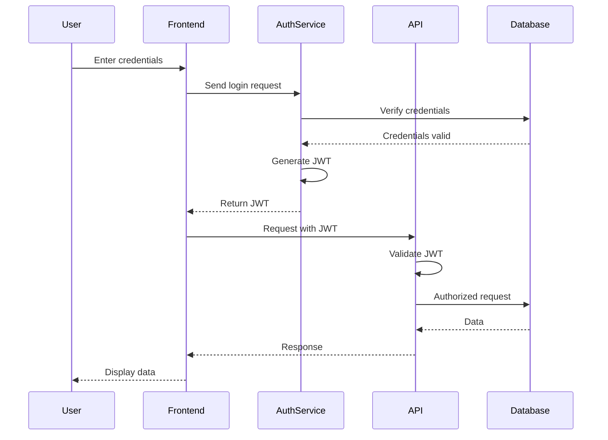

## DATA SECURITY

Ensuring the security of sensitive user data and podcast content is paramount for the Podcast Marketing Automation SaaS platform.

1. Encryption:
   - Data at rest:
     - Use AES-256 encryption for database storage
     - Implement transparent data encryption (TDE) for PostgreSQL
   - Data in transit:
     - Enforce TLS 1.3 for all network communications
     - Implement HTTP Strict Transport Security (HSTS)

2. Key Management:
   - Utilize a dedicated Key Management Service (KMS) for secure key storage and rotation
   - Implement regular key rotation schedules

3. Data Classification:
   - Classify data based on sensitivity:
     - Public
     - Internal
     - Confidential
     - Restricted
   - Apply appropriate security controls based on classification

4. Data Masking and Anonymization:
   - Implement data masking for sensitive information in non-production environments
   - Use anonymization techniques for analytics data

5. Secure File Storage:
   - Store audio files and large assets in encrypted cloud storage (e.g., AWS S3 with server-side encryption)
   - Implement signed URLs with short expiration for file access

6. Database Security:
   - Use parameterized queries to prevent SQL injection
   - Implement row-level security in PostgreSQL for multi-tenant data isolation

7. Backup and Recovery:
   - Encrypt backups using a separate encryption key
   - Regularly test backup restoration process
   - Store backups in a geographically separate location

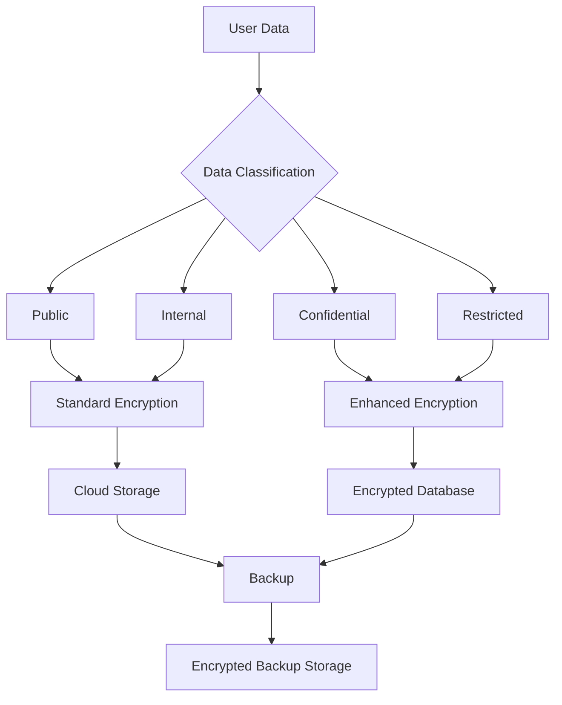

## SECURITY PROTOCOLS

The following security protocols will be implemented to maintain the overall security posture of the Podcast Marketing Automation SaaS platform:

1. Secure Development Lifecycle (SDL):
   - Implement security requirements gathering
   - Conduct threat modeling during design phase
   - Perform regular code reviews with security focus
   - Automated security testing integration in CI/CD pipeline

2. Vulnerability Management:
   - Regular vulnerability scans of infrastructure and applications
   - Implement a responsible disclosure program
   - Timely patching of identified vulnerabilities

3. Incident Response Plan:
   - Develop and maintain an incident response plan
   - Conduct regular incident response drills
   - Establish a security incident response team (SIRT)

4. Logging and Monitoring:
   - Implement centralized logging using the ELK stack (Elasticsearch, Logstash, Kibana)
   - Set up real-time alerting for security events
   - Retain logs for at least 12 months

5. Network Security:
   - Implement Web Application Firewall (WAF)
   - Use Virtual Private Cloud (VPC) for network isolation
   - Regular network penetration testing

6. API Security:
   - Implement API gateway for centralized security controls
   - Use API keys and JWT for authentication
   - Implement rate limiting and request throttling

7. Third-Party Security:
   - Conduct security assessments of third-party integrations
   - Implement vendor risk management program
   - Regular review of third-party access and permissions

8. Compliance and Auditing:
   - Conduct annual security audits
   - Maintain compliance with relevant standards (e.g., SOC 2, ISO 27001)
   - Regular security awareness training for all employees

9. Secure Configuration Management:
   - Use infrastructure as code (IaC) for consistent and secure deployments
   - Implement least privilege principle for all system components
   - Regular security configuration reviews

10. Data Loss Prevention (DLP):
    - Implement DLP policies to prevent unauthorized data exfiltration
    - Use content inspection for outgoing communications

```mermaid
graph TD
    A[Security Protocols] --> B[SDL]
    A --> C[Vulnerability Management]
    A --> D[Incident Response]
    A --> E[Logging and Monitoring]
    A --> F[Network Security]
    A --> G[API Security]
    A --> H[Third-Party Security]
    A --> I[Compliance and Auditing]
    A --> J[Secure Configuration]
    A --> K[DLP]

    B --> L[Security Requirements]
    B --> M[Threat Modeling]
    B --> N[Code Reviews]

    C --> O[Vulnerability Scans]
    C --> P[Responsible Disclosure]

    D --> Q[Response Plan]
    D --> R[Incident Drills]

    E --> S[ELK Stack]
    E --> T[Real-time Alerting]

    F --> U[WAF]
    F --> V[VPC]

    G --> W[API Gateway]
    G --> X[Rate Limiting]

    H --> Y[Vendor Assessments]
    H --> Z[Access Reviews]

    I --> AA[Security Audits]
    I --> AB[Compliance Maintenance]

    J --> AC[IaC]
    J --> AD[Least Privilege]

    K --> AE[DLP Policies]
    K --> AF[Content Inspection]
```

These security considerations provide a comprehensive approach to protecting the Podcast Marketing Automation SaaS platform, its users, and their data. By implementing these measures, the platform will maintain a strong security posture and build trust with its users.